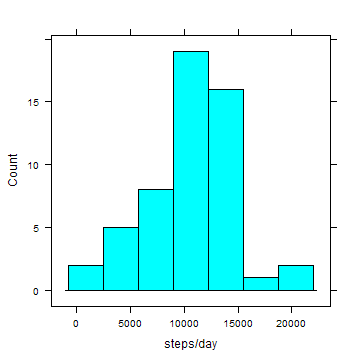
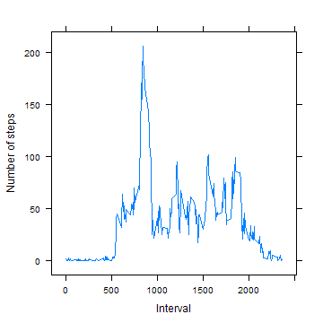
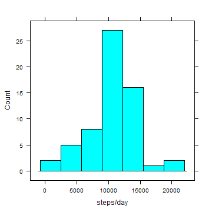
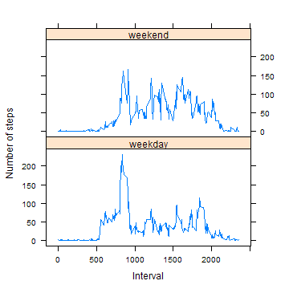

Reproducible Research Peer Analysis 1
========================================================
by mericcanusta
--------------------------------------------------------
This assignment makes use of data from a personal activity monitoring device.
This device collects data at 5 minute intervals through out the day. The data
consists of two months of data from an anonymous individual collected during
the months of October and November, 2012 and include the number of steps taken
in 5 minute intervals each day.

Required: Lattice Package
-------------------------------------------------------
This code requires the [lattice package][lattice] for drawing its plots.
[lattice]:http://cran.r-project.org/web/packages/lattice/index.html

```r
require(lattice)
```

```
## Loading required package: lattice
```


Data
-------------------------------------------------------
The data for this assignment can be downloaded from the course web site:

* Dataset: [Activity monitoring data (52K)][s1]
[s1]:https://d396qusza40orc.cloudfront.net/repdata%2Fdata%2Factivity.zip

The variables included in this dataset are:

1. **steps**: Number of steps taking in a 5-minute interval (missing values are coded as NA)
2. **date**: The date on which the measurement was taken in YYYY-MM-DD format
3. **interval**: Identifier for the 5-minute interval in which measurement was taken

The dataset is stored in a comma-separated-value (CSV) file named "activity.csv" and there are a total of 17,568 observations in this dataset.

Retrieving the file
-------------------------------------------------------
The data is downloaded to the working directory if it isn't already downloaded.
[cURL][curl] is needed for non-Windows platforms.
[curl]:http://curl.haxx.se

```r
archivename <- "repdata_data_activity.zip"
filename <- "activity.csv"
# Check if file exists in the working directory, otherwise download Requires
# curl for non-Windows platforms
if (!file.exists(archivename)) {
    DownloadMethods <- c("internal", "curl")
    fileurl <- "https://d396qusza40orc.cloudfront.net/repdata%2Fdata%2Factivity.zip"
    download.file(fileurl, archivename, mode = "wb", method = DownloadMethods[2 - 
        as.numeric(.Platform$OS.type == "windows")])
    rm(fileurl, DownloadMethods)
}
```


Reading the file
-------------------------------------------------------
The file is read from its zipped archive. The variables **steps** and **interval** are stored as numeric vectors, and **date** is stored as a POSIXct vector under the data frame named "data".


```r
data <- read.csv(file = unz(archivename, filename), colClasses = c("numeric", 
    "character", "numeric"), na.strings = "NA")
# Convert Date to a PosIXct variable
data$date <- as.POSIXct(data$date, format = "%Y-%m-%d")
```


What is mean total number of steps taken per day?
-------------------------------------------------------
We start by calculating the sum of steps for each date and store it in a
data frame called "totsteps"

```r
totsteps <- data.frame(x = sapply(split(data$steps, data$date), sum))
```

Then, we build a *histogram()* of the daily steps:

```r
histogram(~x, totsteps, type = "count", na.rm = TRUE, xlab = "steps/day")
```

 

Finally, we calculate the *summary()* statistics, including the mean and the median:

```r
summary(totsteps)
```

```
##        x        
##  Min.   :   41  
##  1st Qu.: 8841  
##  Median :10765  
##  Mean   :10766  
##  3rd Qu.:13294  
##  Max.   :21194  
##  NA's   :8
```

The daily number of steps seems to be a well-centered distribution with a wide
support starting from 41, all the way
up to 21194.

What is the average daily activity pattern across time intervals?
-------------------------------------------------------
We start by calculating the average number of steps for each interval and store in 
a data frame called "avgsteps"

```r
avgsteps <- data.frame(y = sapply(split(data$steps, data$interval), function(x) mean(x, 
    na.rm = TRUE)))
```

Then, we build our plot as follows:

```r
xyplot(y ~ as.numeric(row.names(avgsteps)), data = avgsteps, type = "l", xlab = "Interval", 
    ylab = "Number of steps")
```

 

Hence, maximum activity seems to occur around morning, with some activity in the
evening/early night.
Furthermore, we can print the names of intervals that has the maximum number of 
steps as follows:

```r
row.names(subset(avgsteps, y >= max(y)))
```

```
## [1] "835"
```

Thus, maximum number of steps, in average, occurs between 835
and 840 a.m.

How should we account for the possible impact of missing values?
-------------------------------------------------------
First, we start by counting how many steps data are missing. This is easy using
the *table()* function:

```r
table(is.na(data$steps))
```

```
## 
## FALSE  TRUE 
## 15264  2304
```

Thus, a sizeable 13.1148
percent of the step data is missing.

One way to account for the missing values is to "guess" them as their interval means, or to assume that they
don't have an impact on our time inferences. We pertain to a short loop construction to store our "NA-free"
data into the data frame "data_nona":

```r
data_nona <- data
for (i in 1:nrow(data)) {
    if (is.na(data$steps[i])) 
        data_nona$steps[i] <- avgsteps[as.character(data$interval[i]), "y"]
}
```

We continue by calculating the sum of steps for each date and store in "totsteps_nona":

```r
totsteps_nona <- data.frame(x = sapply(split(data_nona$steps, data_nona$date), 
    sum))
```

Then, we build a *histogram()* of the "corrected" daily steps:

```r
histogram(~x, totsteps_nona, type = "count", na.rm = TRUE, xlab = "steps/day")
```

 

And also, the *summary()*:

```r
summary(totsteps_nona)
```

```
##        x        
##  Min.   :   41  
##  1st Qu.: 9819  
##  Median :10766  
##  Mean   :10766  
##  3rd Qu.:12811  
##  Max.   :21194
```

Although the mean and median are minimally affected, as expected (a trivial
exercise - or wait for upcoming classes to see why. [Reference][ref]) the inclusion does center the distribution around its mean.
[ref]:http://www.springer.com/statistics/book/978-3-642-39911-4

Are there differences in activity patterns between weekdays and weekends?
-------------------------------------------------------
We first create a new factor variable in the dataset with two levels - "weekday" 
and "weekend" indicating whether a given date is a weekday or weekend day.

```r
data_nona <- cbind(data_nona, weektime = weekdays(data_nona$date), stringsAsFactors = FALSE)
```


```r
for (i in 1:nrow(data_nona)) {
    if (data_nona$weektime[i] == "Saturday" | data_nona$weektime[i] == "Sunday") {
        data_nona$weektime[i] <- "weekend"
    } else {
        data_nona$weektime[i] <- "weekday"
    }
}
```

Then, we obtain the average number of steps taken in each time interval,
and by the factor "weekday"-"weekend". We make use of multi-variable splitting
of the "NA-free" data table using *split(...,list())*, row-name splitting using *strsplit()* and augmenting each factor combination to its corresponding mean using a short loop:

```r
avgsteps_nona <- data.frame(y = sapply(split(data_nona$steps, list(data_nona$interval, 
    data_nona$weektime)), mean))
columnlist <- strsplit(row.names(avgsteps_nona), "[.]")
avgsteps_nona <- cbind(avgsteps_nona, int = 0, weektime = "0", stringsAsFactors = FALSE)
for (i in 1:nrow(avgsteps_nona)) {
    avgsteps_nona$int[i] <- as.numeric(columnlist[[i]][1])
    avgsteps_nona$weektime[i] <- columnlist[[i]][2]
}
```

Thus, it becomes very simple to make a panel plot containing a time series plot 
of the 5-minute interval (x-axis) and the average number of steps taken, averaged 
across all weekday days or weekend days (y-axis).

```r
xyplot(y ~ int | weektime, data = avgsteps_nona, type = "l", xlab = "Interval", 
    ylab = "Number of steps", layout = c(1, 2))
```

 

It is qualitatively evident that the steps are more dispersed during weekends,
and more concentrated to the mornings and late evening/early night during weekdays.
> Released May 13, 2014 by mericcanusta
